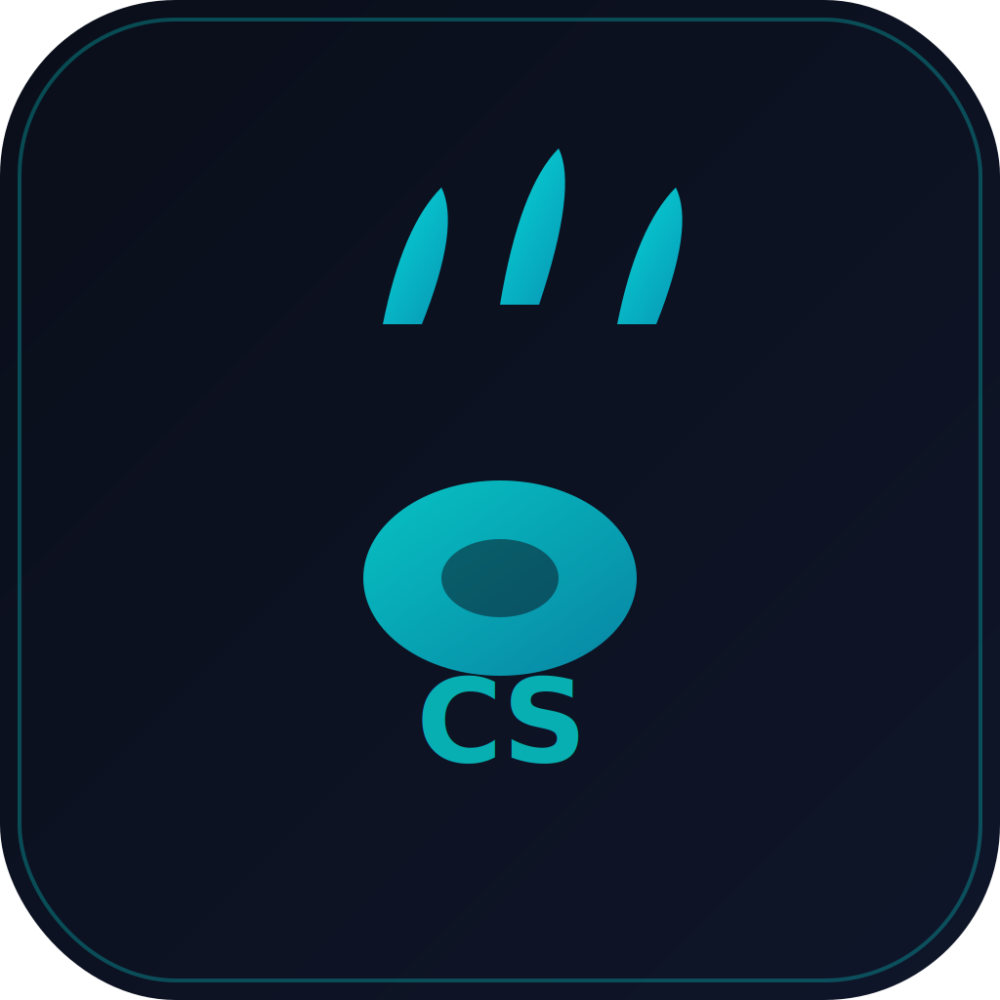

# ClawStudio Nova

<div align="center">
  
  
  <h3>🦞 OpenClaw 可视化管理工作站</h3>
  
  <p>一键安装、可视化监控、零门槛使用 OpenClaw 的桌面应用。<br>
  <strong>The "God Mode" Proxy — OpenClaw 与大模型之间的强制收费站和安检机。</strong></p>

  <p>
    
    
    
    
  </p>
</div>

---

## 📦 下载安装

### Windows

| 版本 | 下载 | 说明 |
|------|------|------|
| v0.2.0 | [ClawStudio_0.2.0_x64_portable.zip](https://github.com/Eplayed/ClawStudio/releases/download/v0.2.0/ClawStudio_0.2.0_x64_portable.zip) | **推荐** 包含 v2.1 代理架构 |

> ⚠️ v0.2.0 使用全新的本地反向代理架构，请优先下载最新版本。

### macOS / Linux

暂无预编译版本，请从源码编译。

---

## ✨ 核心功能

### 🛡️ 本地反向代理（v2.1 新增）

**ClawStudio 不再是旁观者，而是 OpenClaw 与大模型之间的强制收费站和安检机。**

```
[OpenClaw] → [ClawStudio Proxy:18788] → [LLM API]
                    ↓
           ┌──────┴──────┐
           │   拦截层      │
           ├──────────────┤
           │ • Token 提取 │ → 实时费用更新
           │ • HITL 检测  │ → 挂起高危请求
           │ • 熔断机制   │ → 超预算切断
           └──────────────┘
```

| 功能 | 说明 |
|------|------|
| **精确计费** | 从 API 响应体直接提取 `usage.input_tokens/output_tokens`，结合模型费率精确计算 |
| **思维流解析** | 解析 `content[type=text]` 渲染为左侧面板的灰色"思维流" |
| **动作流解析** | 解析 `content[type=tool_use]` 渲染为青色的"执行流" |
| **HITL 拦截** | 网络层挂起高危操作(bash/rm等)，弹窗审批后放行 |
| **熔断机制** | 预算超限自动切断转发，支持动态调整预算 |

### 🚀 Setup Wizard（安装向导）
- **一键安装 Node.js** - 自动检测并安装
- **一键安装 OpenClaw** - 支持 npm 镜像加速
- **API Key 配置** - 安全存储于系统 Keychain
- **模型选择** - Claude / GPT-4o / DeepSeek
- **通道配置** - Telegram / Discord / WeChat
- **双重启动** - 自动启动 Proxy + Gateway

### 📊 Dashboard（仪表盘）
- OpenClaw 运行状态实时监控
- Gateway 启动/停止/重启
- 活跃 Agent 统计
- 今日费用 + 7 天趋势

### 📺 Overwatch（监控舱）
- **LLM Monitor** - 实时显示 Token/Thinking/Action 事件流
- 视觉流（VNC 桌面）
- HITL 审批系统

### 💰 Cost Monitor（烧钱计算器）
- 预算油表（实时更新）
- Token 分解（input/output/image）
- 自动熔断（超预算暂停）

---

## 🚀 快速开始

### 方式一：下载安装包（推荐）

1. 访问 [Releases](https://github.com/Eplayed/ClawStudio/releases) 页面
2. 下载 `ClawStudio_0.2.0_x64_portable.zip`
3. 解压后双击 `clawstudio.exe` 运行
4. 首次启动进入 Setup Wizard

### 方式二：从源码编译

#### 前置要求

| 工具 | 版本 | 说明 |
|------|------|------|
| Node.js | ≥ 22.0 | JavaScript 运行时 |
| pnpm | ≥ 9.0 | 包管理器 |
| Rust | ≥ 1.70 | 后端编译 |
| VS Build Tools | 2022 | Windows 编译必需 |

#### 编译步骤

```bash
# 1. 克隆仓库
git clone https://github.com/Eplayed/ClawStudio.git
cd ClawStudio

# 2. 安装依赖
pnpm install

# 3. 开发模式运行
pnpm tauri dev

# 4. 构建生产版本
pnpm tauri build
```

#### Windows 额外步骤

```powershell
# 安装 Visual Studio Build Tools
winget install Microsoft.VisualStudio.2022.BuildTools --override "--wait --passive --add Microsoft.VisualStudio.Workload.VCTools --includeRecommended"
```

---

## 🏗 架构说明

### 代理模式（v2.1）

```
用户启动 ClawStudio
        ↓
   Setup Wizard
        ↓
配置 OpenClaw API Base URL → http://127.0.0.1:18788
        ↓
启动 ClawStudio Proxy (port 18788)
        ↓
启动 OpenClaw Gateway (port 18789)
        ↓
   Dashboard
        ↓
[OpenClaw 发送 LLM 请求]
        ↓
[ClawStudio Proxy 拦截]
        ├─ 提取 usage → 更新油表
        ├─ 解析 thinking → MonitorPanel
        ├─ 解析 action → MonitorPanel
        ├─ 检测高危工具 → HITL 弹窗
        └─ 熔断检查 → 超限切断
        ↓
[转发到 LLM API]
```

### 关键端口

| 端口 | 服务 | 说明 |
|------|------|------|
| 18788 | ClawStudio Proxy | 拦截 OpenClaw 的 LLM 请求 |
| 18789 | OpenClaw Gateway | OpenClaw 主服务 |

---

## 🧪 运行测试

```bash
# Rust 后端测试 (42 tests)
cd src-tauri
cargo test --lib

# Vue 前端测试
pnpm test

# 代理集成测试
bash tests/mock_hitl_request.sh
```

---

## 📁 项目结构

```
ClawStudio/
├── src/                    # Vue 3 前端
│   ├── views/              # 页面组件
│   │   ├── SetupWizard.vue # 安装向导
│   │   ├── Dashboard.vue   # 仪表盘
│   │   ├── Overwatch.vue   # 监控舱
│   │   └── CostMonitor.vue # 费用监控
│   ├── components/         # UI 组件
│   │   ├── MonitorPanel.vue     # LLM Monitor
│   │   ├── HITLBar.vue         # HITL 审批条
│   │   ├── CircuitBreakerModal.vue # 熔断弹窗
│   │   └── FuelGauge.vue       # 油表组件
│   ├── stores/             # Pinia 状态
│   │   └── proxy.ts        # 代理事件监听
│   └── __tests__/          # 前端测试
│
├── src-tauri/              # Rust 后端
│   └── src/
│       ├── main.rs         # 入口
│       ├── proxy.rs        # 代理核心 (~834行)
│       ├── proxy_state.rs  # 代理状态管理 (~325行)
│       ├── setup.rs        # 环境检测+安装
│       ├── gateway.rs       # Gateway 管理
│       └── tests/           # 后端测试
│
├── hijack.js               # 浏览器端代理脚本
├── tests/
│   ├── mock_hitl_request.sh    # HITL 压测脚本
│   └── integration_test.sh     # 集成测试
│
├── package.json            # 前端依赖
├── Cargo.toml              # Rust 依赖
└── LICENSE                 # AGPL-3.0
```

---

## 🔐 安全性

- **API Key** 通过操作系统原生 Keychain 加密存储
- **HITL 拦截** 危险操作(bash/rm/execute_script等)需人工审批
- **熔断机制** 预算超限自动暂停所有 LLM 请求
- **审计日志** 本地 7 天滚动存储

---

## 📜 开源协议

ClawStudio 采用 **AGPL-3.0** 协议：

- ✅ 个人使用、学习、修改
- ✅ 开源项目集成（需保持 AGPL-3.0）
- ❌ 闭源商业使用（需购买商业授权）

详见 [LICENSE](LICENSE)。

---

## 🤝 贡献指南

欢迎贡献代码、报告 Bug、提出建议！

1. Fork 本仓库
2. 创建分支 (`git checkout -b feature/amazing-feature`)
3. 提交更改 (`git commit -m 'Add amazing feature'`)
4. 推送分支 (`git push origin feature/amazing-feature`)
5. 提交 Pull Request

---

## 🙏 致谢

- [Tauri](https://tauri.app/) - 跨平台桌面框架
- [Vue 3](https://vuejs.org/) - 前端框架
- [Pinia](https://pinia.vuejs.org/) - 状态管理
- [OpenClaw](https://github.com/openclaw/openclaw) - AI Agent 框架
- [Anthropic Claude](https://www.anthropic.com/) - AI 模型

---

<div align="center">
  <p>Made with ❤️ by ClawStudio Team</p>
  <p>
    <a href="https://github.com/Eplayed/ClawStudio/issues">报告 Bug</a> ·
    <a href="https://github.com/Eplayed/ClawStudio/issues">功能建议</a>
  </p>
</div>
